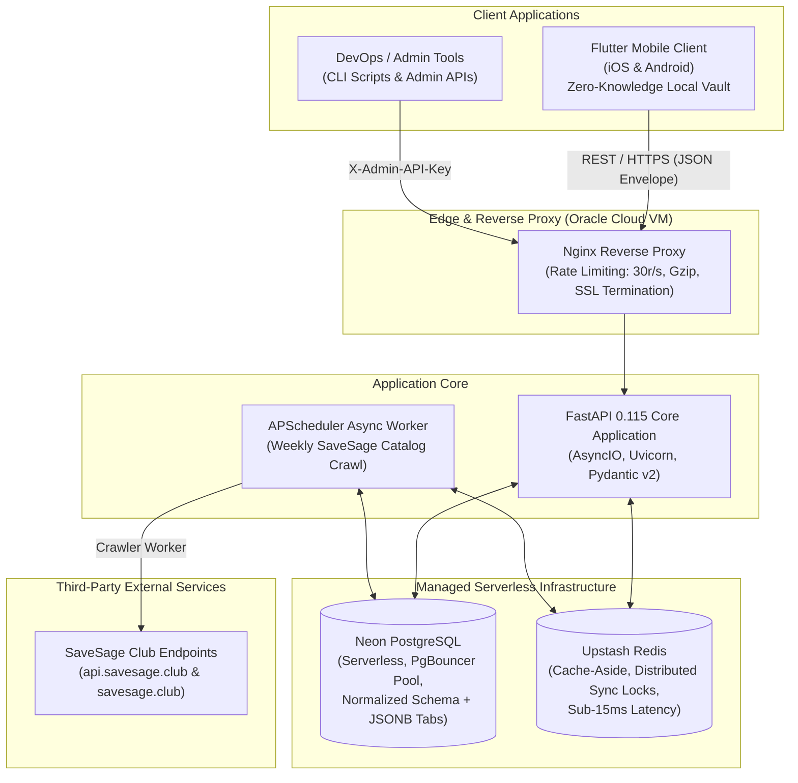
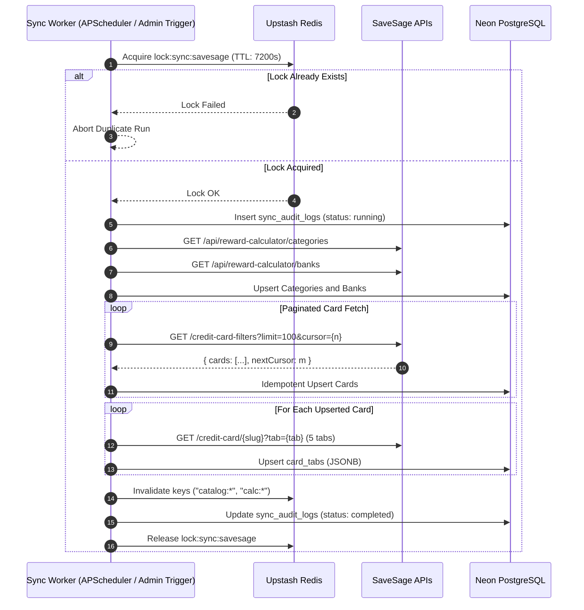

# Technical Architecture & System Design Document

This document provides the in-depth technical architecture, data flows, mathematical formulation, and caching mechanics for the **Credit Card Smart Advisor & Ingestion Service**.

---

## 1. High-Level System Architecture

---

## 2. Zero-Knowledge Card Storage Architecture (PCI-DSS & Store Compliance)

### The Constraint:
Under **PCI-DSS Level 1-4**, **RBI Indian Banking Regulations**, and **Google Play / Apple App Store Data Safety Guidelines**, storing uncertified credit card Primary Account Numbers (16-digit PANs) and CVVs on a central backend database is illegal and grounds for instant rejection or ban from app stores.

### The Solution:
1. **Frontend Local Vault**:
   - The Flutter mobile app stores the 16-digit card number and CVV exclusively within the device's hardware Secure Enclave:
     - **iOS**: `kSecAccessControlBiometryAny` via iOS Keychain Services.
     - **Android**: Hardware-backed Android Keystore with Biometric Prompt.
2. **Backend Zero-Knowledge Metadata**:
   - The backend `user_cards` table only stores non-sensitive metadata:
     - `card_id` (foreign key to the catalog model)
     - `nickname` (e.g. "Everyday Grocery Card")
     - `last_4_digits` (e.g. "4321" for UI display)
     - `billing_cycle_day` (e.g. 15)
3. **Copy-Paste Flow**:
   - When the user taps "Copy Card Number", the device prompts for FaceID/Fingerprint locally, decrypts the card number from the local secure enclave, copies it to the system clipboard, and schedules a 30-second auto-clear timer. The backend is never in the critical path for sensitive data.

---

## 3. Data Ingestion & Crawler Pipeline

### Ingestion Flow:

### Rate Limiting & Resilience:
- **Jitter & Polite Delay**: 200ms - 350ms delay between consecutive HTTP requests.
- **Exponential Backoff**: If HTTP 429 is encountered, backing off exponentially (`2^attempt + random(1..3)s`).
- **Resilient Fallback**: In the event Redis is unreachable, the system automatically falls back to an in-memory TTL cache and local thread-safe lock.

---

## 4. Algorithmic Decision Engines

### 4.1 "Which Card Should I Use?" (Smart Advisor)

For an incoming request with spend amount $A$ and category $C$:

$$\text{Effective Return} = \begin{cases} 
0\% & \text{if } C \in \text{Exclusions} \\
\frac{A}{\text{Spend Threshold}} \times \text{Accelerated Points} \times \text{Point Value} & \text{if accelerated rule exists} \\
A \times \text{Base Return Rate} & \text{fallback}
\end{cases}$$

If the transaction is international and foreign currency:
$$\text{Net Return \%} = \max(0, \text{Effective Return \%} - \text{Forex Markup \%})$$

Cards are sorted in descending order of net monetary value in INR:
$$\text{Rank 1} = \max_{c \in \text{User Cards}} (\text{Net Monetary Value}_c)$$

### 4.2 Reward Calculator Engine
Computes offline points, monetary valuation, and benchmark comparison:
$$\text{Annual Projected Savings} = \max(0, (\text{Benchmark Value} - \text{User Card Value}) \times 12)$$

---

## 5. Caching & Redis Strategy (Upstash Free Tier)

| Key Pattern | Data Structure | TTL | Invalidation Event |
|---|---|---|---|
| `catalog:cards:{hash}` | JSON String | 3,600s (1 hour) | Catalog sync completion |
| `catalog:card:{slug}` | JSON String | 3,600s (1 hour) | Catalog sync completion |
| `catalog:card:{slug}:tab:{tab}` | JSON String | 86,400s (24 hours) | Catalog sync completion |
| `calc:banks` | JSON String | 86,400s (24 hours) | Catalog sync completion |
| `calc:categories` | JSON String | 86,400s (24 hours) | Catalog sync completion |
| `lock:sync:savesage` | String | 7,200s (2 hours auto-release) | Sync finish or exception |
